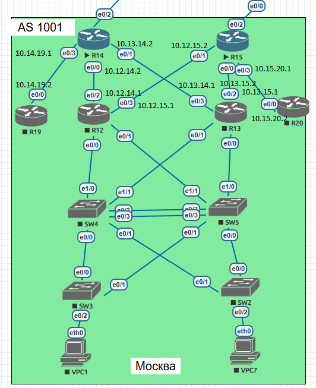

#  IPv4

###  Задание:

  1. Разработать и задокументировать адресное пространство;
  2. Настроить IP адреса на каждом активном порту;
  3. Использовать IPv4 и IPv6;
  4. Задокументировать все изменения.

###  1. Задокументируем используемое адресное пространство с использованием IPv4.

Общая таблица сетей.
| Network IPv4     | Summary net    |
|-----------------:|:---------------|
| 10.0.0.0/8       | не знаю        |

